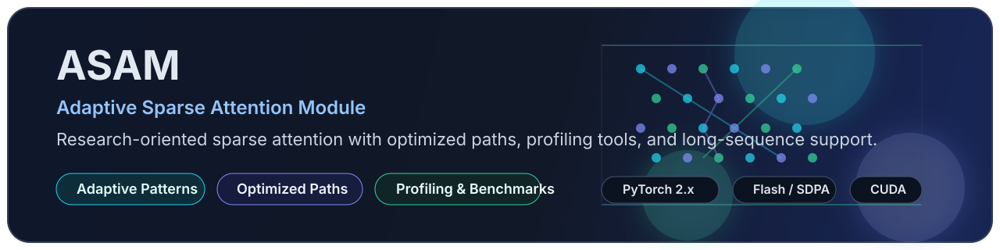
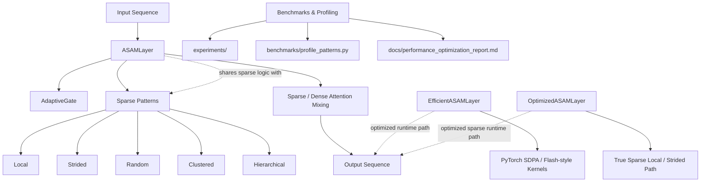

# ASAM: Adaptive Sparse Attention Module

[中文说明](README.zh-CN.md)



[](https://www.python.org/)
[](https://pytorch.org/)
[](LICENSE)
[](https://github.com/li-guohao/asam-attention/releases)

ASAM is a research-oriented attention module that combines **adaptive sparse patterns** with **hardware-aware optimized implementations** for long-sequence modeling.

This repository includes:

- the original `ASAMLayer` implementation,
- efficient PyTorch 2.x attention variants built on `scaled_dot_product_attention`,
- a true sparse optimized path for local and strided attention,
- profiling and benchmarking scripts for sparse pattern construction and runtime behavior.

## Highlights

- Adaptive sparse attention with local, strided, random, clustered, and hierarchical patterns
- Optimized inference paths for consumer GPUs
- Flash / SDPA-based efficient attention variants for PyTorch 2.x
- Mixed precision training examples
- Sparse pattern profiling and optimization reports
- End-to-end tests covering core layers and sparse pattern behavior

## Latest Update

The latest release, [`v1.2.0`](https://github.com/li-guohao/asam-attention/releases/tag/v1.2.0), focuses on:

- sparse path optimizations,
- pattern construction acceleration,
- hierarchical pattern caching,
- clustered assignment optimization,
- profiling support via `benchmarks/profile_patterns.py`.

See:

- [Changelog](CHANGELOG.md)
- [Performance Optimization Report](docs/performance_optimization_report.md)

## Implementations

## Architecture Overview

The diagram below shows how the main ASAM components relate to each other inside this repository.



### 1. `ASAMLayer`

The main adaptive sparse attention layer with gating and pattern selection.
In this default layer, adaptive gating is a differentiable sparse/dense soft mixture; true compute savings are provided by the optimized sparse paths below.

```python
from asam import ASAMLayer, ASAMConfig

config = ASAMConfig(
    dim=256,
    num_heads=4,
    pattern_type="local",
    use_adaptive_gate=True,
)

layer = ASAMLayer(config)
```

### 2. `EfficientASAMLayer` / `FlashASAMLayer`

PyTorch 2.x efficient attention variants built on `scaled_dot_product_attention`.

```python
from asam.efficient_attention import FlashASAMLayer

layer = FlashASAMLayer(dim=256, num_heads=4, window_size=128)
```

### 3. `OptimizedASAMLayer`

An optimized sparse implementation for local and strided attention.

```python
from asam.asam_layer_optimized import OptimizedASAMLayer

layer = OptimizedASAMLayer(dim=256, num_heads=4, window_size=128)
```

## Performance Snapshot

Representative results included in this repository:

| Component | Before | After | Gain |
|---|---:|---:|---:|
| `OptimizedASAMLayer` | 32.84 ms | 24.58 ms | `1.34x` |
| `EfficientASAMLayer` | 12.19 ms | 11.30 ms | `1.08x` |
| `LocalSparsePattern.build_pattern()` | 28.55 ms | 17.81 ms | `1.60x` |
| `StridedSparsePattern.build_pattern()` | 82.09 ms | 18.10 ms | `4.54x` |
| `RandomSparsePattern.build_pattern()` | 540.76 ms | 239.46 ms | `2.26x` |
| `HierarchicalSparsePattern.combine_patterns()` on CUDA | 43.06 ms | 2.94 ms | `14.65x` |

These numbers come from local measurements in the current development environment and should be treated as reference results, not universal benchmarks.

## Installation

### Clone the repository

```bash
git clone https://github.com/li-guohao/asam-attention.git
cd asam-attention
```

### Create an environment

```bash
python -m venv .venv
```

- Windows: `.venv\Scripts\activate`
- macOS / Linux: `source .venv/bin/activate`

### Install dependencies

Install PyTorch first, then install ASAM from source:

```bash
pip install torch torchvision
pip install -e .
```

For development:

```bash
pip install -r requirements.txt
```

## Quick Start

### Basic usage

```python
import torch
from asam import ASAMLayer, ASAMConfig

config = ASAMConfig(
    dim=256,
    num_heads=4,
    pattern_type="local",
    use_adaptive_gate=True,
)

layer = ASAMLayer(config)
x = torch.randn(2, 512, 256)

output, info = layer(x, return_info=True)
print(output.shape)
print(info["sparse_ratio"])
```

### Efficient attention usage

```python
import torch
from asam.efficient_attention import FlashASAMLayer

layer = FlashASAMLayer(dim=256, num_heads=4, window_size=128)
x = torch.randn(2, 512, 256)

output, info = layer(x, return_info=True)
print(output.shape)
print(info["sparse_ratio"])
```

### Example scripts

```bash
python examples/basic_usage.py
python examples/optimized_usage.py
python examples/benchmark.py
```

## Benchmarks and Profiling

### Run benchmark scripts

```bash
python experiments/run_final_benchmark.py
python experiments/benchmark_optimized.py
```

### Profile sparse patterns

```bash
python benchmarks/profile_patterns.py --seq-len 2048 --devices auto
```

### Export profiling results

```bash
python benchmarks/profile_patterns.py --seq-len 2048 --devices auto --json-out benchmarks/pattern_profile.json
```

## Paper Reproduction

For the continual-learning extension and paper-style experiment pipeline, use the scripts below.

### Run the real continual benchmark

```bash
python experiments/run_continual_text_benchmark.py --dataset-name split_ag_news --routing-mode prototype --output-json experiments/continual_benchmark.json
```

This exports raw JSON metrics, plots, and a Markdown report with theory diagnostics and adaptation traces.

The default benchmark configuration is `task_incremental_multihead`: local labels, per-task classifier heads, and oracle task IDs at evaluation. For stricter class-incremental reruns, use global labels and a single classifier head:

```bash
python experiments/run_continual_text_benchmark.py --protocol class_incremental_singlehead --label-mode global --head-mode single --eval-task-id-mode none --dataset-name split_ag_news --routing-mode prototype --output-json experiments/continual_singlehead.json
```

For the strict task-agnostic single-head path, hide task IDs from both training forward passes and evaluation:

```bash
python experiments/run_continual_text_ablation.py --protocol task_agnostic_singlehead --label-mode global --head-mode single --train-task-id-mode none --eval-task-id-mode none --dataset-name split_ag_news --output-json experiments/continual_task_agnostic.json
```

This is a strict no-task-ID model protocol, not a boundary-free streaming benchmark: task partitions are still used to compute continual metrics and exported stage-wise diagnostics.

A small class-incremental protocol-validation artifact is available at `experiments/paper_suite/class_incremental_singlehead_smoke.json` with `avg_accuracy=0.2188` and `avg_forgetting=0.0625` under cached AG News, one seed, char vocabulary 128, and 128/64 train/validation caps. A stricter task-agnostic multi-seed smoke artifact is available at `experiments/paper_suite/task_agnostic_singlehead_ablation_smoke.json`; it uses global labels, a single head, `train_task_id_mode=none`, `eval_task_id_mode=none`, BPE vocabulary 10,000, two seeds, and 128/64 train/validation caps. It skips both task-routed and task-conditioned dual-transport strategies as incompatible. Treat these as protocol-plumbing checks, not replacements for the paper-scale BPE tables.

### Run the multi-seed ablation suite

```bash
python experiments/run_continual_text_ablation.py --output-json experiments/continual_ablation.json --num-seeds 2
```

This compares compatible strategies from `task_routing`, `no_adaptation`, `correlation`, `dual_transport`, and `meta_secant`, and exports aggregated JSON / CSV / PNG / Markdown artifacts. Strict no-task-ID protocols skip task-conditioned strategies, including `task_routing` and `dual_transport`, and record the reason in the summary.

### Run the one-command paper suite

```bash
python scripts/run_continual_paper_suite.py --output-dir experiments/paper_suite
```

On Windows PowerShell:

```powershell
powershell -ExecutionPolicy Bypass -File scripts/run_paper_continual_suite.ps1 --output-dir experiments/paper_suite
```

This pipeline runs the benchmark, runs the multi-seed ablation, and writes a final suite manifest plus paper-ready summary report.

### Canonical paper artifacts and reproduction

Every number in the paper tables is traceable to a saved artifact under `experiments/paper_suite/`, and the mapping is enforced by `tests/test_paper_artifacts_consistency.py`:

- Table 1 (BPE strategy ablation): `r2_agnews_bpe_3ep.json`
- Table 2 (operator ablation): `continual_operator_ablation.json`
- Table 3 (baseline comparison, unified no-replay method rows + ER/A-GEM): `r3_baseline_comparison.json`
- Single-run diagnostics: `continual_benchmark.json`
- Bootstrap 95% intervals: `bootstrap_ci.json`

Reproduce Table 1 (BPE, D=128, 3 epochs, 3 seeds):

```bash
python experiments/run_continual_text_ablation.py --protocol task_incremental_multihead --dataset-name split_ag_news --vocab-size 10000 --dim 128 --num-heads 8 --num-layers 2 --epochs-per-task 3 --num-seeds 3 --max-train-samples 64 --max-val-samples 32 --device cpu --output-json experiments/paper_suite/r2_agnews_bpe_3ep.json
```

Reproduce Table 3 (byte-level, D=64, 1 epoch, 2 seeds):

```bash
python experiments/run_baseline_comparison.py --num-seeds 2 --epochs-per-task 1 --dim 64
```

Reproduce the bootstrap intervals and run the table guards:

```bash
python experiments/bootstrap_ci.py
python -m pytest tests/test_paper_artifacts_consistency.py -q
```

The review-response document for the ICLR-style review is at `docs/ICLR_RESPONSE.md`.

## Project Structure

```text
asam-attention/
├── asam/                         # Core library
│   ├── asam_layer.py             # Main ASAM implementation
│   ├── asam_layer_optimized.py   # Optimized sparse attention path
│   ├── efficient_attention.py    # SDPA / Flash-style attention layers
│   ├── adaptive_gate.py          # Adaptive gating module
│   ├── sparse_patterns.py        # Sparse pattern implementations
│   └── __init__.py
├── benchmarks/                   # Benchmark and profiling tools
├── docs/                         # Documentation
├── examples/                     # Usage examples
├── experiments/                  # Experiment scripts
├── tests/                        # Unit tests
├── CHANGELOG.md
└── README.md
```

## Documentation

- [Chinese README](README.zh-CN.md)
- [Changelog](CHANGELOG.md)
- [Performance Analysis Report](docs/analysis_report.md)
- [Performance Optimization Report](docs/performance_optimization_report.md)
- [Continual ASAM Guide](docs/CONTINUAL_ASAM.md)
- [API Documentation](docs/API.md)
- [Technical Deep Dive](docs/TECHNICAL.md)
- [Experiments Guide](docs/EXPERIMENTS_GUIDE.md)

## Testing

Run the full test suite:

```bash
python -m pytest tests -q
```

Run selected tests:

```bash
python tests/test_basic.py
python tests/test_efficient.py
python tests/test_asam.py
```

## Requirements

- Python 3.8+
- PyTorch 2.0+
- Optional CUDA GPU for optimized and benchmark paths

## Notes

- The repository includes both baseline and optimized implementations.
- Some optimization claims depend on GPU architecture and sequence length.
- The profiling scripts are intended to help you evaluate the trade-offs on your own hardware.

## License

This project is released under the [MIT License](LICENSE).
