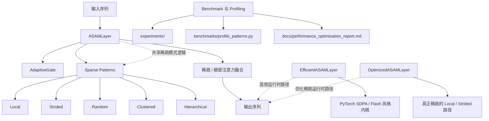

# ASAM：自适应稀疏注意力模块

[English](README.md)


[](https://www.python.org/)
[](https://pytorch.org/)
[](LICENSE)
[](https://github.com/li-guohao/asam-attention/releases)

ASAM 是一个面向长序列建模的研究型注意力模块，将**自适应稀疏模式**与**面向硬件的优化实现**结合在一起。

本仓库包含：

- 原始版本的 `ASAMLayer`
- 基于 PyTorch 2.x `scaled_dot_product_attention` 的高效注意力实现
- 针对 local / strided 场景的优化稀疏路径
- 稀疏模式构造、缓存和运行时行为的 profiling / benchmark 工具

## 主要特性

- 支持 local、strided、random、clustered、hierarchical 等稀疏模式
- 针对消费级 GPU 的优化推理路径
- 基于 Flash / SDPA 的高效注意力实现
- 提供混合精度训练示例
- 提供稀疏模式 profiling 与性能优化报告
- 提供覆盖核心层与模式行为的测试

## 最新更新

最新版本 [`v1.1.1`](https://github.com/li-guohao/asam-attention/releases/tag/v1.1.1) 重点包括：

- 稀疏路径优化
- pattern 构造加速
- hierarchical pattern 缓存
- clustered assignment 优化
- 新增 `benchmarks/profile_patterns.py` profiling 脚本

可进一步查看：

- [版本记录](CHANGELOG.md)
- [性能优化报告](docs/performance_optimization_report.md)

## 实现说明

## 架构概览

下图展示了仓库中 ASAM 主要模块之间的关系，适合直接在 GitHub 页面查看。



### 1. `ASAMLayer`

主实现，包含自适应门控与模式选择。

```python
from asam import ASAMLayer, ASAMConfig

config = ASAMConfig(
    dim=256,
    num_heads=4,
    pattern_type="local",
    use_adaptive_gate=True,
)

layer = ASAMLayer(config)
```

### 2. `EfficientASAMLayer` / `FlashASAMLayer`

基于 PyTorch 2.x `scaled_dot_product_attention` 的高效实现。

```python
from asam.efficient_attention import FlashASAMLayer

layer = FlashASAMLayer(dim=256, num_heads=4, window_size=128)
```

### 3. `OptimizedASAMLayer`

针对 local / strided 注意力路径的优化版实现。

```python
from asam.asam_layer_optimized import OptimizedASAMLayer

layer = OptimizedASAMLayer(dim=256, num_heads=4, window_size=128)
```

## 性能概览

仓库当前包含的代表性结果如下：

| 组件 | 优化前 | 优化后 | 提升 |
|---|---:|---:|---:|
| `OptimizedASAMLayer` | 32.84 ms | 24.58 ms | `1.34x` |
| `EfficientASAMLayer` | 12.19 ms | 11.30 ms | `1.08x` |
| `LocalSparsePattern.build_pattern()` | 28.55 ms | 17.81 ms | `1.60x` |
| `StridedSparsePattern.build_pattern()` | 82.09 ms | 18.10 ms | `4.54x` |
| `RandomSparsePattern.build_pattern()` | 540.76 ms | 239.46 ms | `2.26x` |
| `HierarchicalSparsePattern.combine_patterns()`（CUDA） | 43.06 ms | 2.94 ms | `14.65x` |

这些数据来自当前开发环境中的本地测量，适合作为参考，不应直接视为所有机器上的通用结果。

## 安装

### 克隆仓库

```bash
git clone https://github.com/li-guohao/asam-attention.git
cd asam-attention
```

### 创建虚拟环境

```bash
python -m venv .venv
```

- Windows：`.venv\Scripts\activate`
- macOS / Linux：`source .venv/bin/activate`

### 安装依赖

建议先安装 PyTorch，再从源码安装 ASAM：

```bash
pip install torch torchvision
pip install -e .
```

如需开发依赖：

```bash
pip install -r requirements.txt
```

## 快速开始

### 基础用法

```python
import torch
from asam import ASAMLayer, ASAMConfig

config = ASAMConfig(
    dim=256,
    num_heads=4,
    pattern_type="local",
    use_adaptive_gate=True,
)

layer = ASAMLayer(config)
x = torch.randn(2, 512, 256)

output, info = layer(x, return_info=True)
print(output.shape)
print(info["sparse_ratio"])
```

### 高效注意力用法

```python
import torch
from asam.efficient_attention import FlashASAMLayer

layer = FlashASAMLayer(dim=256, num_heads=4, window_size=128)
x = torch.randn(2, 512, 256)

output, info = layer(x, return_info=True)
print(output.shape)
print(info["sparse_ratio"])
```

### 示例脚本

```bash
python examples/basic_usage.py
python examples/optimized_usage.py
python examples/benchmark.py
```

## Benchmark 与 Profiling

### 运行 benchmark

```bash
python experiments/run_final_benchmark.py
python experiments/benchmark_optimized.py
```

### 分析 sparse pattern

```bash
python benchmarks/profile_patterns.py --seq-len 2048 --devices auto
```

### 导出 profiling 结果

```bash
python benchmarks/profile_patterns.py --seq-len 2048 --devices auto --json-out benchmarks/pattern_profile.json
```

## 论文复现实验

如果你想复现持续学习扩展与论文风格实验流程，可以直接使用下面这些脚本。

### 运行真实文本持续学习基准

```bash
python experiments/run_continual_text_benchmark.py --dataset-name split_ag_news --routing-mode prototype --output-json experiments/continual_benchmark.json
```

该脚本会导出原始 JSON 指标、诊断图，以及包含理论诊断与自适应轨迹的 Markdown 报告。

### 运行多随机种子消融实验

```bash
python experiments/run_continual_text_ablation.py --output-json experiments/continual_ablation.json --num-seeds 2
```

该实验会比较 `task_routing`、`no_adaptation`、`correlation` 与 `meta_secant`，并导出聚合后的 JSON / CSV / PNG / Markdown 结果。

### 一键运行论文实验套件

```bash
python scripts/run_continual_paper_suite.py --output-dir experiments/paper_suite
```

Windows PowerShell 下可使用：

```powershell
powershell -ExecutionPolicy Bypass -File scripts/run_paper_continual_suite.ps1 --output-dir experiments/paper_suite
```

该流程会顺序运行基准实验与多种子消融，并输出最终的 suite manifest 和可直接用于论文整理的总结报告。

## 项目结构

```text
asam-attention/
├── asam/                         # 核心库代码
│   ├── asam_layer.py             # 主 ASAM 实现
│   ├── asam_layer_optimized.py   # 优化稀疏注意力路径
│   ├── efficient_attention.py    # SDPA / Flash 风格实现
│   ├── adaptive_gate.py          # 自适应门控模块
│   ├── sparse_patterns.py        # 稀疏模式实现
│   └── __init__.py
├── benchmarks/                   # Benchmark 与 profiling 工具
├── docs/                         # 项目文档
├── examples/                     # 示例代码
├── experiments/                  # 实验脚本
├── tests/                        # 单元测试
├── CHANGELOG.md
└── README.md
```

## 文档导航

- [英文 README](README.md)
- [版本记录](CHANGELOG.md)
- [性能分析报告](docs/analysis_report.md)
- [性能优化报告](docs/performance_optimization_report.md)
- [Continual ASAM 指南](docs/CONTINUAL_ASAM.md)
- [API 文档](docs/API.md)
- [技术文档](docs/TECHNICAL.md)
- [实验指南](docs/EXPERIMENTS_GUIDE.md)

## 测试

运行完整测试：

```bash
python -m pytest tests -q
```

运行指定测试：

```bash
python tests/test_basic.py
python tests/test_efficient.py
python tests/test_asam.py
```

## 环境要求

- Python 3.8+
- PyTorch 2.0+
- 若要运行优化路径与 benchmark，建议使用支持 CUDA 的 GPU

## 说明

- 仓库中同时包含 baseline 与 optimized 两类实现。
- 某些优化收益会受到 GPU 架构、序列长度和 batch 配置影响。
- profiling 脚本的目标是帮助你在自己的硬件上评估 trade-off。

## 许可证

本项目采用 [MIT License](LICENSE)。
